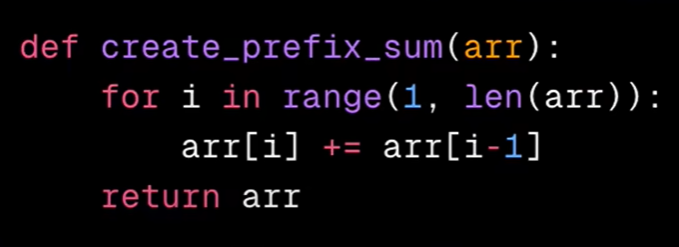

# Data Structures

This file is created as part of my journey to master Data Structures and Algorithms (DSA) for interview preparation. It provides a basic understanding of various data structures along with coding examples for each. While it does not cover all data structures, it focuses on some of the most commonly used ones that are essential for technical interviews.

## What is a Data Structure?

Organizing data to build efficient systems!

## Big-O Notation

Notation for program time complexity  
  
*Reference:* [Big-O Cheat Sheet](https://www.bigocheatsheet.com/)

## Array

Organized data in rows or columns.

### LeetCode Problems

- Two Sum
- Best Time to Buy and Sell Stock
- Contains Duplicate
- Product of Array Except Self
- Majority Element
- Maximum Sub-array
- Maximum Product Sub-array
- Find Minimum in Rotated Sorted Array
- Search in Rotated Sorted Array
- 3 Sum
- Container With Most Water

### Kadane's Algorithm

Kadane's Algorithm is a dynamic programming technique used to find the maximum subarray sum in an array of numbers. The algorithm maintains two variables: `max_current` represents the maximum sum ending at the current position, and `max_global` represents the maximum subarray sum encountered so far. At each iteration, it updates `max_current` to include the current element or start a new subarray if the current element is larger than the accumulated sum. The `max_global` is updated if `max_current` surpasses its value.

### Prefix / Suffix Algorithm

A prefix algorithm computes cumulative results for elements of a sequence up to each index. It processes from left to right, storing intermediate results for use in later calculations.  
Use Cases: Compute running sums or products.  

### Moore Voting Algorithm
- The algorithm starts by assuming the first element as the majority candidate and sets the count to 1.
- As it iterates through the array, it compares each element with the candidate:
- If the current element matches the candidate, it suggests that it reinforces the majority element because it appears again. Therefore, the count is incremented by 1.
- If the current element is different from the candidate, it suggests that there might be an equal number of occurrences of the majority element and other elements. Therefore, the count is decremented by 1. Note that decrementing the count doesn't change the fact that the majority element occurs more than n/2 times.
- If the count becomes 0, it means that the current candidate is no longer a potential majority element. In this case, a new candidate is chosen from the remaining elements.
- The algorithm continues this process until it has traversed the entire array.
- The final value of the candidate variable will hold the majority element.
