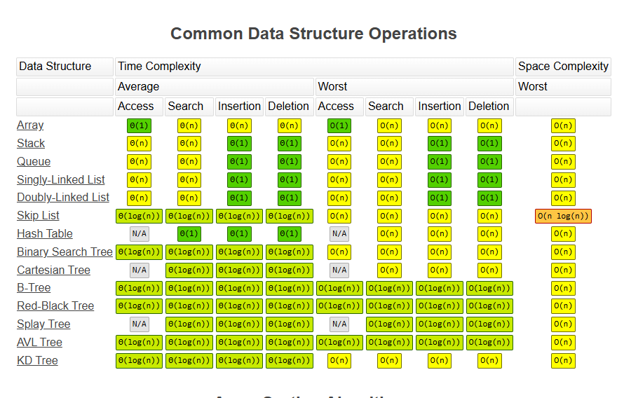

# Data Structure:
- This file will give you basic understanding of Data Structures and coding knowledge for each of them

## What is Data Structure:
- Organizing data to build systems!

## Big-O Notation
- Notation for a program time complexity  

- *Reference:* https://www.bigocheatsheet.com/ 

## Array 
- Organized data in row or columns.
- Leet Code Problems: 
      - Two Sum
      - Best Time to Buy and Sell Stock
      - Contains Duplicate
      - Product of Array Except Self
      - Maximum Sub-array
      - Maximum Product Sub-array
      - Find Minimum in Rotated Sorted Array
      - Search in Rotated Sorted Array
      - 3 Sum
      - Container With Most Water